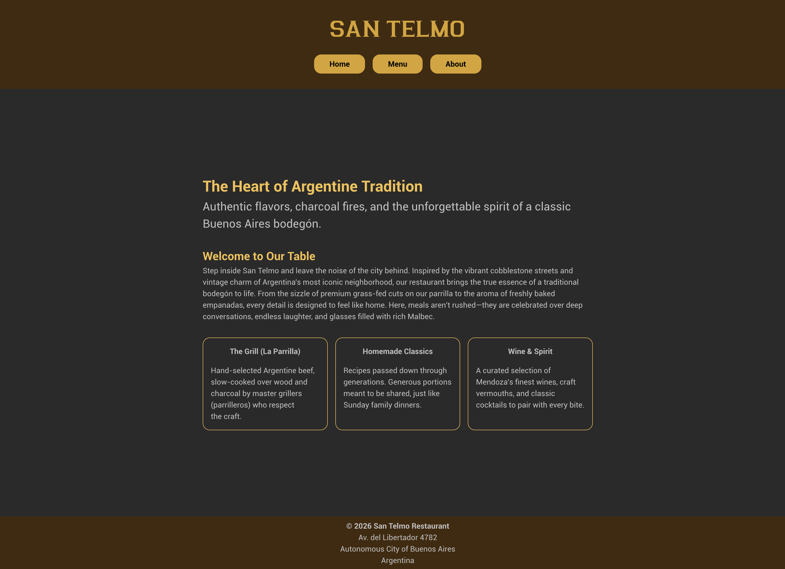
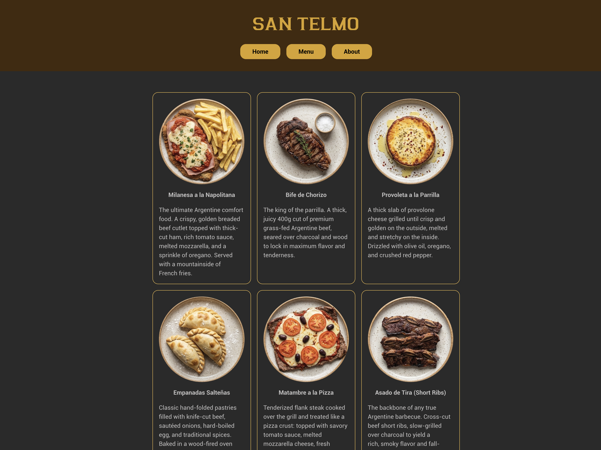

# Restaurant Page

This project belongs to the [JavaScript course](https://www.theodinproject.com/lessons/node-path-javascript-restaurant-page) from [The Odin Project](https://www.theodinproject.com/).

The objective of this project is to implement webpack and modules. The design is required to count with tabbed browsing. 

## Demo

[Try It Here](https://circobit.github.io/restaurant-page/)

## Screenshots

## Credits

- Images generated with [Gemini](https://gemini.google.com/)